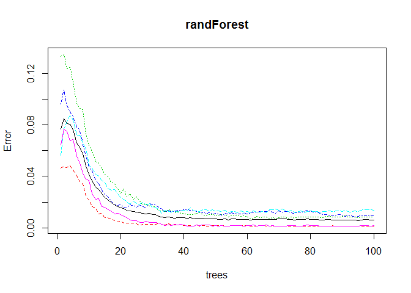

# Prediction Assignment Writeup - Practical Machine Learning
###Alexandre Gabriel

First of all, we load the needed libraries and set a seed:


```r
library(caret)
```

```
## Loading required package: lattice
```

```
## Loading required package: ggplot2
```

```r
library(randomForest)
```

```
## randomForest 4.6-12
```

```
## Type rfNews() to see new features/changes/bug fixes.
```

```
## 
## Attaching package: 'randomForest'
```

```
## The following object is masked from 'package:ggplot2':
## 
##     margin
```

```r
set.seed(1406)
```

Then we set the training and test files:


```r
trainFile<-read.csv("pml-training.csv", header=T)
testFile<-read.csv("pml-testing.csv", header=T)
```

The predictors are all not null (NA) variables which names are related to belt, forearm, arm, and dumbell. The 'classe' variable is put into the predictors set as well. 


```r
trainFileMissing <- sapply(trainFile, function (x) any(is.na(x) | x == ""))
predictors0 <- !trainFileMissing & grepl("belt|arm|dumbbell|forearm", names(trainFileMissing))
predictors <- c("classe",names(trainFileMissing)[predictors0])
```


The next step consists into clean the trainFile (considering only the set predictors as the valid variables for this analysis) and divide cleanTrain into the training and test sets. The test set will be used for cross validation.


```r
cleanTrain <- (trainFile[, predictors])
cleanTrainDivided <- createDataPartition(cleanTrain$classe, p=0.70,list=F)
training<-cleanTrain[cleanTrainDivided,] 
test<-cleanTrain[-cleanTrainDivided,] 
```


Here we see the size and number of variables on each set:


```r
dim(training)
```

```
## [1] 13737    53
```


```r
dim(test)
```

```
## [1] 5885   53
```

Now we define the variable randForest as the fitted predictor to the training set, predicting 'classe' based on all the other prediction variables. We used random forest as the approach to prediction because, according to the classes, it's accurate compared to other approaches.


```r
(randForest = randomForest(classe~., data=training, ntree = 100))
```

```
## 
## Call:
##  randomForest(formula = classe ~ ., data = training, ntree = 100) 
##                Type of random forest: classification
##                      Number of trees: 100
## No. of variables tried at each split: 7
## 
##         OOB estimate of  error rate: 0.62%
## Confusion matrix:
##      A    B    C    D    E class.error
## A 3900    5    0    1    0 0.001536098
## B   15 2637    6    0    0 0.007900677
## C    0   16 2374    6    0 0.009181970
## D    1    0   27 2221    3 0.013765542
## E    0    0    1    4 2520 0.001980198
```

```r
plot(randForest)
```

<!-- -->

In the plot above we can see a 100-sized tree reduces the error to a good level (< 2%).

Below we conclude that the out-of-bag estimate of error rate is 0.62%:


```r
randForest
```

```
## 
## Call:
##  randomForest(formula = classe ~ ., data = training, ntree = 100) 
##                Type of random forest: classification
##                      Number of trees: 100
## No. of variables tried at each split: 7
## 
##         OOB estimate of  error rate: 0.62%
## Confusion matrix:
##      A    B    C    D    E class.error
## A 3900    5    0    1    0 0.001536098
## B   15 2637    6    0    0 0.007900677
## C    0   16 2374    6    0 0.009181970
## D    1    0   27 2221    3 0.013765542
## E    0    0    1    4 2520 0.001980198
```

Finally, predicting the random forest in the test set (from the trainingFile) we get:


```r
prediction <- predict(randForest, test, type = "class")
confusionMatrix(prediction, test$classe)
```

```
## Confusion Matrix and Statistics
## 
##           Reference
## Prediction    A    B    C    D    E
##          A 1672    5    0    0    0
##          B    2 1131    4    0    0
##          C    0    3 1022   16    0
##          D    0    0    0  946    0
##          E    0    0    0    2 1082
## 
## Overall Statistics
##                                           
##                Accuracy : 0.9946          
##                  95% CI : (0.9923, 0.9963)
##     No Information Rate : 0.2845          
##     P-Value [Acc > NIR] : < 2.2e-16       
##                                           
##                   Kappa : 0.9931          
##  Mcnemar's Test P-Value : NA              
## 
## Statistics by Class:
## 
##                      Class: A Class: B Class: C Class: D Class: E
## Sensitivity            0.9988   0.9930   0.9961   0.9813   1.0000
## Specificity            0.9988   0.9987   0.9961   1.0000   0.9996
## Pos Pred Value         0.9970   0.9947   0.9817   1.0000   0.9982
## Neg Pred Value         0.9995   0.9983   0.9992   0.9964   1.0000
## Prevalence             0.2845   0.1935   0.1743   0.1638   0.1839
## Detection Rate         0.2841   0.1922   0.1737   0.1607   0.1839
## Detection Prevalence   0.2850   0.1932   0.1769   0.1607   0.1842
## Balanced Accuracy      0.9988   0.9959   0.9961   0.9907   0.9998
```

So the accuracy is 99.46%.

As as appendix, the Course Project Prediction Quiz will be answered based on the set below: 


```r
predictionRF <- predict(randForest, testFile)
predictionRF
```

```
##  1  2  3  4  5  6  7  8  9 10 11 12 13 14 15 16 17 18 19 20 
##  B  A  B  A  A  E  D  B  A  A  B  C  B  A  E  E  A  B  B  B 
## Levels: A B C D E
```
